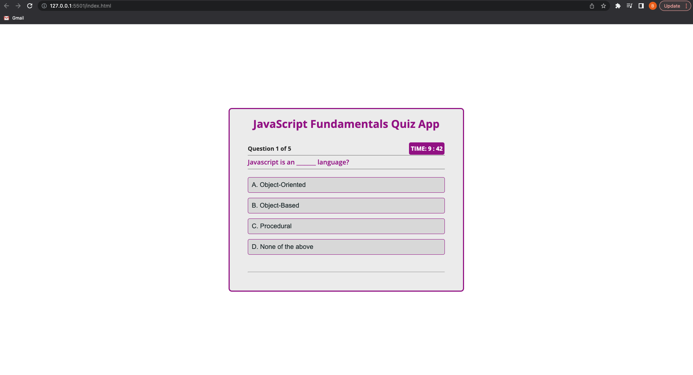
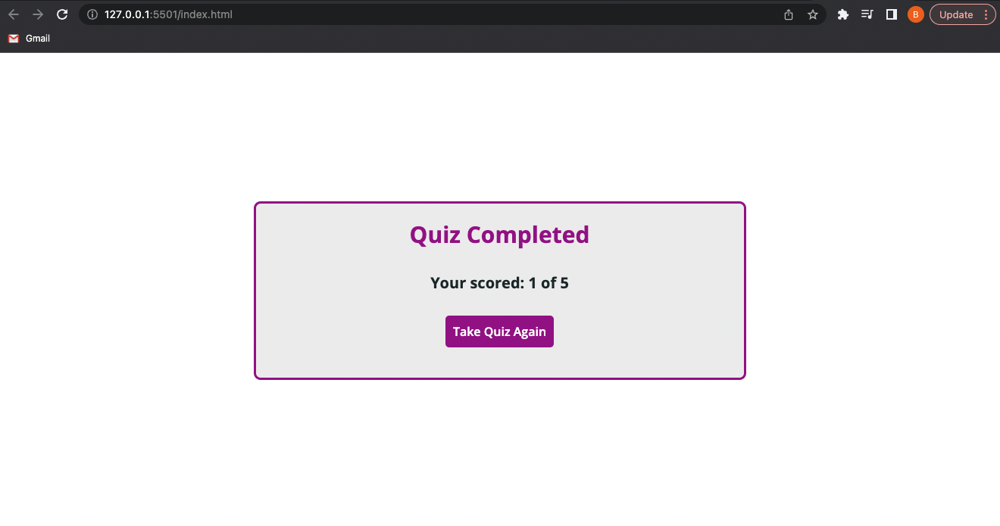

# JavaScript-fundamentals-quiz

## Description

As a bootcamp student, I wanted to develop this quiz app on JavaScript Fundamentals in order to practice different JavaScript concepts. This app features different questions and their respective options, saving the scores.

## Installation

## Usage

The JavaScript Fundamentals App is very user-friendly. When you enter the app, you will see the following page:

You will have to select each answer, then after you completed the quiz you will see your final score and you can click on the Take Quiz Again button.

## Credits

N/A

## License

Please refer to the LICENSE in the repo.